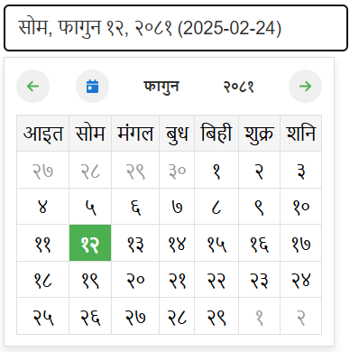

const datePickerRef = useRef(null);
    const handleDateSelect = (dateInfo) => {
        // dateInfo contains:
        // - bsYear, bsMonth, bsDate (Bikram Sambat date)
        // - formattedDate (formatted based on dateFormat and language)
        // - bsDate (YYYY-MM-DD in selected language numbers)
        // - adDate (YYYY-MM-DD in English numbers)
    };

    {/* For Nepali Calendar */}
    <StnNepaliDatePicker
        ref={datePickerRef}
        dateFormat="%D, %M %d, %y"
        onDateSelect={handleDateSelect}
        language="nepali"
    />
    {/* English (AD) Calendar with current date */}
    <StnNepaliDatePicker
        ref={datePickerRef}
        dateFormat="%D, %M %d, %y"
        onDateSelect={handleDateSelect}
        language="english"
    />
        
# satan-date-picker
